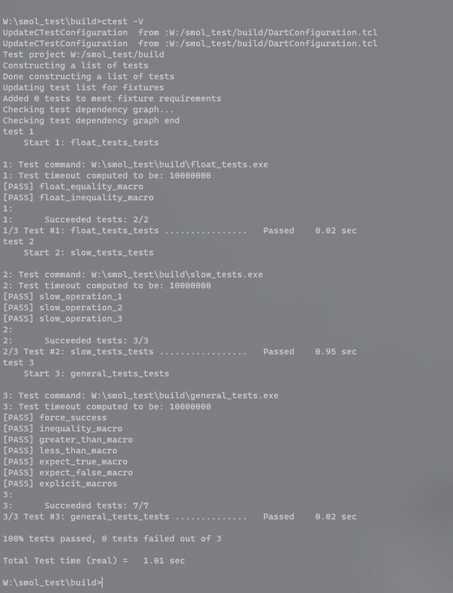

# smol_test
SMOL_TEST is a minimalist test framework I developed for testing features on my toy [game engine](https://github.com/marciovmf/smol)

## Why
Test frameworks are usually feature rich but also bloated and unnecessarily complex, so I decided to create something tiny especially for my needs.


## How it works

Basically you compile your tests along with the test framework itself. It's composed by a .h file and a .cpp file. 

## Defining tests

Tests are just blocks of code declared within the `SMOL_TEST()` macro
```
SMOL_TEST(test_name)
{
  // your test code goes here
}
```


The following macros are available for specifying tests:

### SMOL_TEST_FAIL
Ends the test and mark it as PASS

### SMOL_TEST_SUCCESS 
Ends the test and mark it as FAIL

### SMOL_TEST_EXPECT_FLOAT_EQ(A, B)
Passes if float expressions A and B are equal. Fails otherwise.

### SMOL_TEST_EXPECT_FLOAT_NEQ(A, B)
Passes if float expressions A and B are NOT equal. Fails otherwise.

### SMOL_TEST_EXPECT_GT(A, B)
Passes if integer expression A is greater than B. Fails otherwise.

### SMOL_TEST_EXPECT_LT(A, B)
Passes if integer expression A is less than B. Fails otherwise.

### SMOL_TEST_EXPECT_TRUE( exp )
Passes if expression expr is true. Fails otherwise.

### SMOL_TEST_EXPECT_FALSE( exp )
Passes if expression expr is false. Fails otherwise.


## Compiling tests
This CMake macro is used to create test suites, or standalone executables that
may contain multiple unit tests.

````
function(SMOL_TEST_ADD_EXECUTABLE target sourceList)
  list(APPEND sourceList smol_test.cpp smol_test.h)
  add_executable(${target} ${sourceList})
  set_property(TARGET ${target} PROPERTY CXX_STANDARD 11)
  # Include necesary include paths as needed.
  target_include_directories(${target} PRIVATE "${CMAKE_CURRENT_SOURCE_PATH}")
  # Include necessary libs as needed 
  #target_link_libraries(${target} PRIVATE smol ${OPENGL_LIBRARY})
  # Make it a CTest target
  add_test(NAME ${target}_tests COMMAND ${target})
  #Comment the next line to avoid running this test automatically
  add_custom_command(TARGET ${target} POST_BUILD COMMAND ${CMAKE_CTEST_COMMAND} ${target})
endfunction()
````

To add test suits just call the macro passing the name of the test and it's
source files. For example:

````
SMOL_TEST_ADD_EXECUTABLE(float_tests sample/float_tests.cpp)
SMOL_TEST_ADD_EXECUTABLE(slow_tests sample/slow_tests.cpp)
SMOL_TEST_ADD_EXECUTABLE(general_tests sample/general_tests.cpp)
````

## Running Tests

It's possible to run the test suites directly or via Cmake with the --target test or even invoking CTest directly in the build directory.

Running the standalone test executables


Running all the tests via Ctest


Note that the standalone tests will exit the process with exit value 0 if the all test fails or the number of failed tests otherwise.


